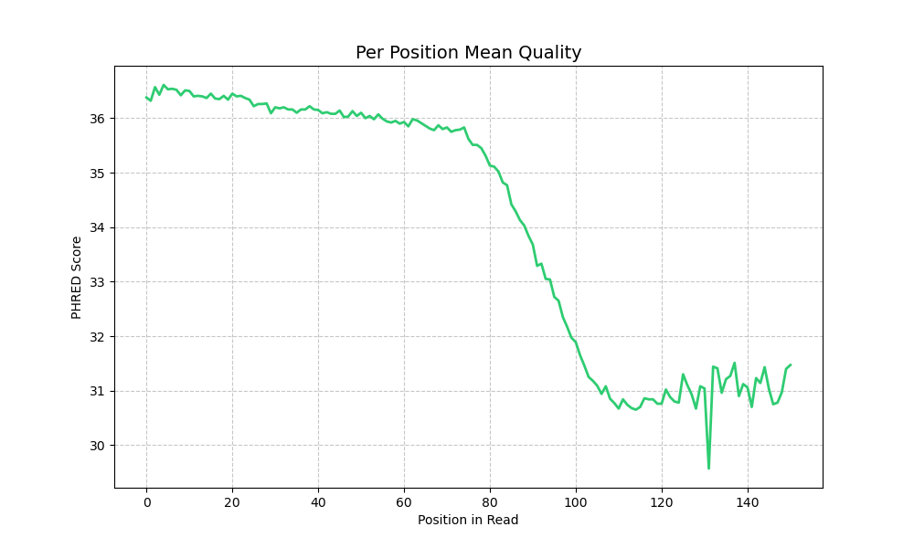
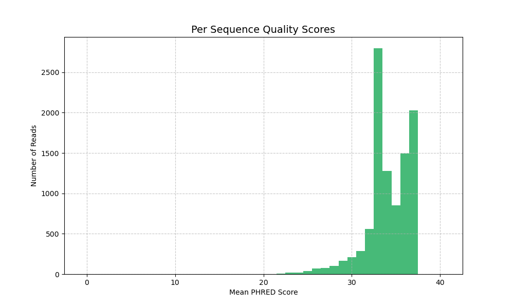
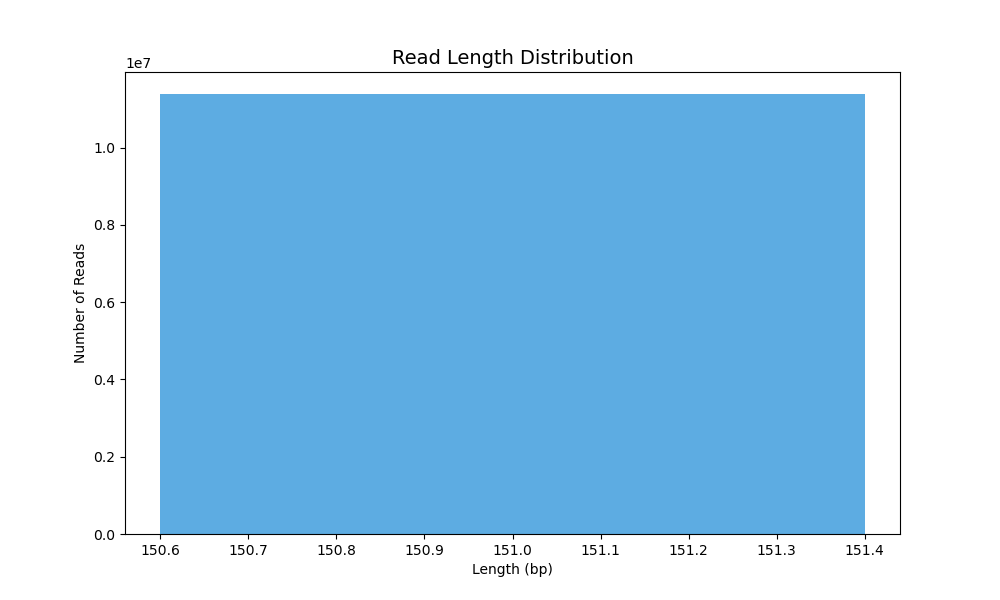
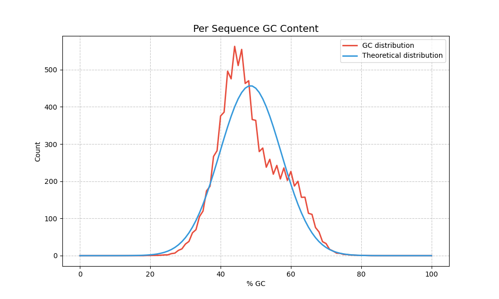
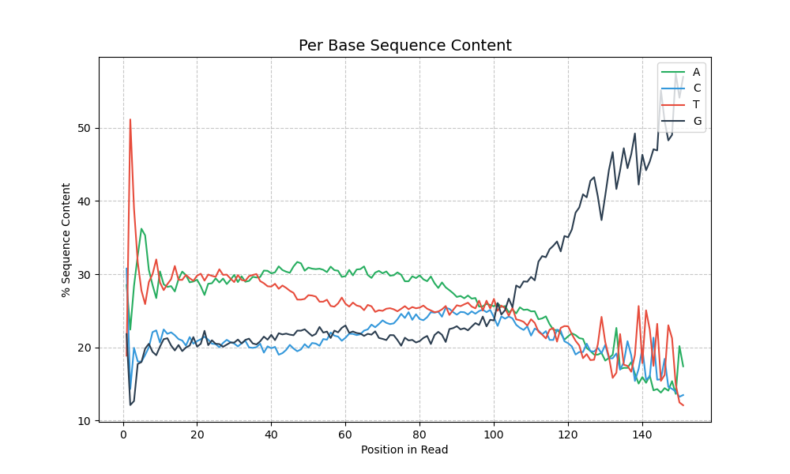
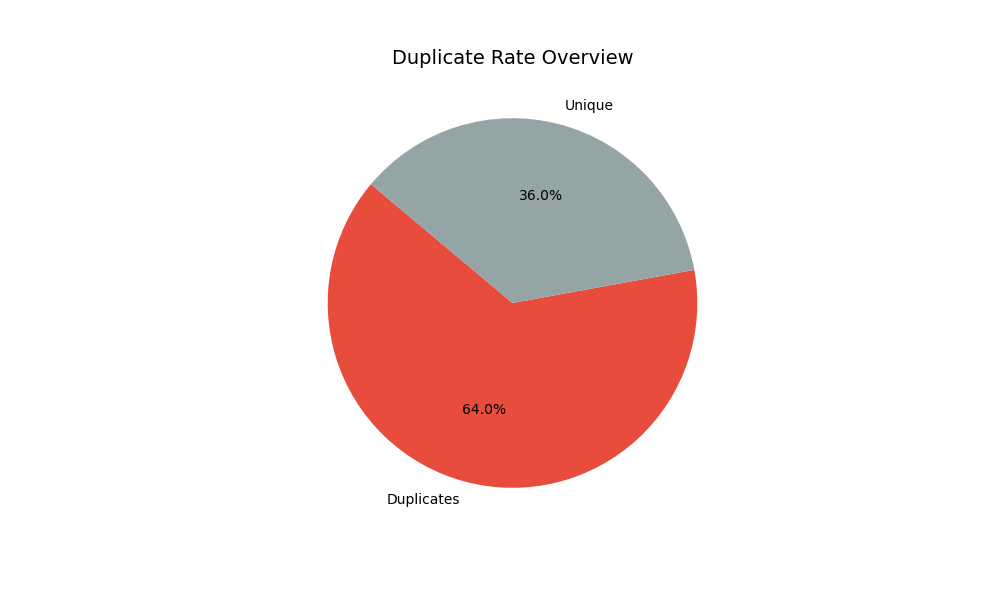
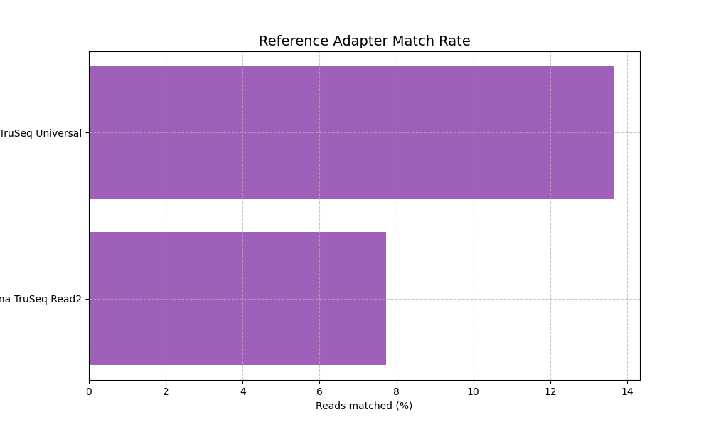

# FastqScout

**FastqScout** is a lightweight Python tool for **pre-flight quality control** of FASTQ sequencing data. It analyzes a statistical sample of reads, computes essential QC metrics, detects Illumina adapter signal, and returns an actionable verdict — **`PROCEED`**, **`TRIM`**, or **`REJECT`** — before you spend time on full FastQC / fastp runs.

```
FASTQ  →  FastqScout (sample + verdict)  →  FastQC / fastp / pipeline
```

> **Quick demo:** open [`report.html`](report.html) or [`reports/sample_scout.html`](reports/sample_scout.html) in a browser — full reports with **plain-language plot captions**, **CpG composition hints**, and optional **LLM summary** (local Qwen).

---

## Why FastqScout?

| Tool | Role |
|------|------|
| **FastQC** | Full diagnostic QC — thorough, but slow on large files |
| **fastp** | Trimming + filtering — runs on the whole file |
| **FastqScout** | **Pre-flight gate** — fast sample-based decision: proceed, trim first, or reject |

FastqScout answers: *"Is this library worth processing? What should I run next?"*

---

## Features

### Core QC metrics
- **Per-position quality** — PHRED by read position (head vs tail drop)
- **Per-sequence quality** — Q20 / Q30 rates, quality histogram
- **Length distribution** — min / mean / max read length
- **GC content** — histogram + main-peak Gaussian fit
- **Per-base sequence content** — A/C/G/T plus N, IUPAC ambiguous bases, and U (RNA)
- **Duplicate rate** — fraction of duplicated sequences
- **CpG O/E ratio** — observed/expected CG dinucleotides; genome composition hint (always in base report)

### Genome composition hint (CpG O/E)
- Computes **CpG O/E** = observed CG dinucleotides / expected from C×G composition
- Soft sanity check with `--expected-species human|mouse|drosophila|ecoli` (metadata mismatch → issue, not REJECT)
- Typical profiles: mammalian genomes ~0.15–0.35 (CpG suppression); bacteria/insects often closer to 1.0
- **Disclaimer:** composition hint only — not taxonomic ID (use Kraken / sourmash for species)

### Plain-language report (wet-lab friendly)
- **Plot captions** — 2–3 sentences under **every QC chart** explaining what the plot means and what your numbers imply (always on, no flags)
- **Rule-based summary** (`--explain`) — English template: verdict, what looks good, what to watch, next steps
- **Optional local LLM** (`--explain-llm`) — Qwen rewrites the template in simpler English; falls back to template if output is unreliable
- Summary and captions use the same metrics as the report — no invented numbers

### Statistical sampling
- Auto sample budget from **Cochran / mean formulas** (95% confidence)
- Separate budgets for base QC vs adapter detection (`--mode with_adapter`)
- Caps: `--min-reads`, `--max-fraction`, `--max-reads`, `--full-file`
- Sampling details in HTML report and JSON export

### Adapter detection (reference-first)
- Matches read tails against **known Illumina adapters** (TruSeq Universal, Read2, Nextera, Small RNA)
- Outputs a **short trim sequence** ready for fastp (`--adapter_sequence …`)
- **De novo fallback** if no reference matches (short k-mer motif, ≤20 bp)
- R1 → Universal adapter; R2 → Read2 adapter (paired-end mode)

### Library-aware verdict engine
- **`--library-type genome`** — stricter duplicate thresholds; high duplicates → REJECT
- **`--library-type transcriptome`** — relaxed duplicate rules; higher default sample size
- Context-specific recommendations (WGS dedup vs RNA-seq rRNA note)

### Layouts
- **Single-end** — one FASTQ file
- **Paired-end** — R1 + R2; separate metrics, adapters, and R2 summary section

### Outputs
- **Self-contained HTML report** — verdict, metrics, CpG hint, issues, fastp-ready recommendations, plot captions, optional summary
- **JSON export** — metrics, sampling plan, scout verdict (pipeline-friendly)
- **PNG plots** — optional `--plot-dir`
- **Exit codes** — `0` PROCEED / `1` TRIM / `2` REJECT

---

## Project structure

```text
fastq-scout/
├── reports/
│   ├── sample_scout.html      # Example HTML report (open in browser)
│   ├── sample_scout.json      # Example JSON export
│   └── plots/                 # Example PNG plots
├── docs/images/               # Plot previews for README
├── src/fastq_scout/
│   ├── cli.py                 # CLI entry point
│   ├── reader.py              # Streaming FASTQ reader + sample budget
│   ├── pipeline.py            # Metric orchestration
│   ├── metrics.py             # QC metrics + AdapterDiscovery
│   ├── sampling.py            # Statistical sample size
│   ├── adapter_references.py  # Known Illumina adapter DB
│   ├── adapter_searching.py   # Reference matching + de novo fallback
│   ├── scout.py               # Verdict engine (FastqScout)
│   ├── species_composition.py # CpG O/E profiles + expected-species check
│   ├── explain.py             # Template summary + plot captions + LLM payload
│   ├── qween_model.py         # Optional local Qwen for --explain-llm
│   ├── profiles.py            # genome / transcriptome thresholds
│   ├── run_context.py         # Layout + library type context
│   ├── plot.py                # PNG plot generation
│   └── report.py              # HTML report builder
└── README.md
```

---

## Installation

**Requirements:** Python 3.10+, matplotlib. For `--explain-llm`: `transformers`, `torch`, and a Hugging Face model (default: `Qwen/Qwen2.5-0.5B-Instruct`).

```bash
pip install matplotlib
# optional, for --explain-llm:
pip install transformers torch accelerate

git clone <repo-url>
cd fastq-scout
export PYTHONPATH=src
```

---

## Usage examples

### 1. Minimal run (single-end, genome)

Generates `<input_stem>_scout.html` next to the FASTQ:

```bash
export PYTHONPATH=src
python src/fastq_scout/cli.py your_sample.fastq
```

### 2. Full run with adapter detection (recommended for unknown libraries)

```bash
export PYTHONPATH=src
python src/fastq_scout/cli.py your_sample.fastq \
  --mode with_adapter \
  --library-type genome \
  --expected-species human \
  -o report.html \
  --json reports/sample_scout.json \
  --plot-dir reports/plots
```

CpG O/E and plot captions are included automatically. Add `--explain` for a plain-language summary section.

### 3. Plain-language summary (template, English, no model download)

```bash
export PYTHONPATH=src
python src/fastq_scout/cli.py your_sample.fastq \
  --mode with_adapter \
  --library-type genome \
  --expected-species human \
  --explain \
  -o report.html
```

### 4. Summary + optional local LLM (Qwen)

The LLM **paraphrases the rule-based summary** (not raw JSON). If the model output fails validation, the template is used instead.

```bash
export PYTHONPATH=src
python src/fastq_scout/cli.py your_sample.fastq \
  --mode with_adapter \
  --library-type genome \
  --expected-species human \
  --explain --explain-llm \
  --llm-model Qwen/Qwen2.5-0.5B-Instruct \
  -o report.html
```

Terminal prints `Summary source: template` or `Summary source: llm`. For best LLM quality, use `Qwen/Qwen2.5-1.5B-Instruct` or larger if available locally.

### 5. Transcriptome (RNA-seq)

Relaxed duplicate thresholds; minimum sample size ≥ 50K reads:

```bash
export PYTHONPATH=src
python src/fastq_scout/cli.py rnaseq_sample.fastq \
  --library-type transcriptome \
  --mode with_adapter \
  -o reports/rnaseq_scout.html
```

### 6. Paired-end WGS

R1 uses Illumina Universal adapter; R2 uses Read2 adapter:

```bash
export PYTHONPATH=src
python src/fastq_scout/cli.py sample_R1.fastq sample_R2.fastq \
  --layout paired \
  --library-type genome \
  --mode with_adapter \
  -o reports/pe_scout.html \
  --json reports/pe_scout.json
```

### 7. Large file — control sampling

```bash
export PYTHONPATH=src
python src/fastq_scout/cli.py huge_sample.fastq \
  --min-reads 100000 \
  --max-fraction 0.05 \
  --mode with_adapter
```

### 8. Full-file analysis (no sampling)

```bash
export PYTHONPATH=src
python src/fastq_scout/cli.py your_sample.fastq --full-file
```

---

## CLI reference

| Option | Default | Description |
|--------|---------|-------------|
| `fastq` | — | R1 or single-end FASTQ (required) |
| `fastq_r2` | — | R2 FASTQ (required with `--layout paired`) |
| `--layout` | `single` | `single` or `paired` |
| `--library-type` | `genome` | `genome` or `transcriptome` |
| `--expected-species` | — | Optional: `human`, `mouse`, `drosophila`, `ecoli` — CpG/GC sanity check |
| `-o, --output` | `<stem>_scout.html` | HTML report path |
| `--json` | — | JSON export path |
| `--plot-dir` | — | Save PNG plots (also embedded in HTML) |
| `--explain` | off | Add plain-language summary (English template) |
| `--explain-llm` | off | Try local Qwen to rewrite summary; fallback to template |
| `--llm-model` | `Qwen/Qwen2.5-0.5B-Instruct` | Hugging Face model for `--explain-llm` |
| `-c, --chunk-size` | `10000` | Reads per processing chunk |
| `--mode` | `base` | `base` or `with_adapter` |
| `--min-reads` | `10000` | Minimum reads in auto sample |
| `--max-fraction` | `0.15` | Max fraction of file to analyze |
| `--max-reads` | — | Hard cap on reads analyzed |
| `--full-file` | off | Analyze entire file |
| `--margin-rate` | `0.05` | CI margin for rate metrics |
| `--margin-mean` | `1.0` | CI margin for mean PHRED |

### Exit codes

| Code | Verdict | Meaning |
|------|---------|---------|
| `0` | `PROCEED` | Sample looks good for downstream analysis |
| `1` | `TRIM` | Preprocessing recommended (trimming, filtering) |
| `2` | `REJECT` | Quality too low — investigate or re-sequence |

---

## HTML report

Open [`report.html`](report.html) or [`reports/sample_scout.html`](reports/sample_scout.html) — no server needed.

The report includes:

1. **Run context** — layout, library type, optional expected species
2. **Sampling section** — total reads, sample budget, confidence margins, formula-derived *n*
3. **Verdict banner** — `PROCEED` / `TRIM` / `REJECT` with explanation
4. **Summary cards** — quality, Q20/Q30, GC, duplicates, **CpG O/E**, adapter match
5. **Genome composition hint** — CpG O/E interpretation + species check (if `--expected-species` set)
6. **Adapter discovery** — matched reference, **fastp trim sequence**, identity %
7. **Issues & recommendations** — copy-paste fastp commands, e.g. `fastp --adapter_sequence GTCTGAACTCCAGTCAC`
8. **Plain-language summary** (with `--explain`) — Summary / What looks good / What to watch / Next steps
9. **QC plots** — embedded PNG with **plain-language caption under each chart** (always on)

### What wet-lab scientists see under each plot

Every chart gets a short English note, for example:

> *This plot shows how often adapter sequence appears on R1 read tails. Adapters are lab oligos that should be removed before mapping reads to a genome. TruSeq Universal was detected on about 13.65% of tails. Trim these with fastp using the suggested sequence in the report.*

No LLM required for plot captions — they are rule-based from the same metrics as the chart.

### Optional LLM summary (`--explain-llm`)

When enabled, a local **Qwen** instruct model rewrites the template summary in friendlier prose. Design choices:

- **Template first** — metrics → deterministic draft → optional LLM paraphrase (not generation from scratch)
- **Validation** — verdict and key numbers must appear in the output; Cyrillic / garbage patterns rejected
- **Fallback** — if the model fails or 0.5B output is weak, the rule-based template is shown instead

This keeps the report trustworthy while letting non-bioinformaticians read one English page before opening FastQC or running fastp.

For paired-end: separate sampling tables for R1/R2, R2 summary section, R2 plots with R2 captions.

---

## Example results

Real run: **SRR37361581** bacterial isolate, **11,387,076 reads**, 151 bp, **10,000-read sample** (0.09%), `--mode with_adapter`:

| Metric | Value |
|--------|-------|
| Mean quality (PHRED) | 34.1 |
| Q20 / Q30 | 95.3% / 87.0% |
| Mean GC | 48.5% |
| **CpG O/E ratio** | **0.78** (high — not typical for human genome) |
| Duplicate rate | 5.7% |
| Adapter content | 13.65% |
| Matched reference | Illumina TruSeq Universal |
| fastp trim sequence | `GTCTGAACTCCAGTCAC` |
| **Verdict** | **TRIM** |

**Issues:** quality drop at read tail; bimodal GC; adapter signal on tails; CpG/GC mismatch vs `--expected-species human`

**Recommendations:**
```bash
fastp --adapter_sequence GTCTGAACTCCAGTCAC  # Illumina TruSeq Universal
fastp --cut_tail --cut_window_size 4 --cut_mean_quality 20
```

With `--explain`, the HTML report adds a **Plain-language summary** section. With `--explain --explain-llm`, Qwen may rewrite that text; plot captions are always template-based.

Full data: [`reports/sample_scout.json`](reports/sample_scout.json)

---

## Plots

Generated plots (also in [`reports/plots/`](reports/plots/)):

### Per-position quality


### Per-sequence quality scores


### Read length distribution


### GC content (histogram + main-peak fit)


### Per-base sequence content


### Duplicate rate


### Adapter reference match rate


---

## How it works

```text
                    ┌─────────────────────────────────┐
                    │  Statistical sample budget      │
                    │  (Cochran + mean formulas)      │
                    └───────────────┬─────────────────┘
                                    │
FASTQ ──► FastqReader (stream) ──► Pipeline ──► metrics dict
                                    │
                    ┌───────────────┼───────────────┐
                    │               │               │
              PerPositionQ    GCContent      AdapterDiscovery
              LengthDist      Duplicates     (reference-first)
                    │               │               │
                    └───────────────┼───────────────┘
                                    │
                              FastqScout
                         (profiles: genome /
                          transcriptome)
                                    │
                    ┌───────────────┴───────────────┐
                    │  PROCEED / TRIM / REJECT      │
                    │  + fastp recommendations      │
                    └───────────────┬───────────────┘
                                    │
                              HtmlReport + JSON
                         (plot captions + optional LLM summary)
```

### fastp integration

FastqScout is designed to run **before** fastp: adapter trim sequences and quality flags in the report map directly to fastp CLI arguments. The HTML report is meant to be readable by wet-lab staff; bioinformaticians still get JSON and exact commands.

---

## Programmatic usage

```python
from pathlib import Path

from fastq_scout.reader import FastqReader
from fastq_scout.pipeline import Pipeline
from fastq_scout.metrics import (
    PerPositionQuality, PerSequenceQuality, LengthDistribution,
    GCContent, DuplicateRate, AdapterDiscovery,
)
from fastq_scout.run_context import RunContext
from fastq_scout.scout import FastqScout
from fastq_scout.report import HtmlReport, build_plot_paths

reader = FastqReader("sample.fastq", chunk_size=10_000, sample_budget=10_000)
pipeline = Pipeline(metrics=[
    PerPositionQuality(),
    PerSequenceQuality(),
    LengthDistribution(),
    GCContent(),
    DuplicateRate(),
    AdapterDiscovery(adapter_set="universal"),
])

results = pipeline.run(reader)
ctx = RunContext(layout="single", library_type="genome")
verdict, scout_report = FastqScout(ctx).result(results)

plot_paths = build_plot_paths(results, Path("plots"))
HtmlReport(Path("sample.fastq"), results, scout_report, plot_paths).save(
    Path("sample_scout.html")
)
print(verdict, scout_report["recommendations"])
```

---

## Positioning vs existing tools

| | FastqScout | FastQC | fastp |
|---|-----------|--------|-------|
| Speed on 10M+ reads | Fast (sampled) | Slow (full file) | Moderate (full file) |
| Verdict | **Yes** | No | No |
| Adapter → fastp command | **Yes** | Partial (module) | Auto-detect |
| Plain-language plot captions | **Yes** | No | No |
| Optional LLM summary | **Yes** | No | No |
| CpG / composition hint | **Yes** | Partial | No |
| Statistical sample plan | **Yes** | No | No |
| Library-type profiles | **Yes** | No | No |

FastqScout is **complementary** — run it first, then FastQC/fastp on libraries that pass the gate.

---

## Roadmap

- [x] Statistical sampling with confidence intervals
- [x] Adapter detection (reference-first + de novo fallback)
- [x] Single / paired-end layouts
- [x] Genome / transcriptome profiles
- [x] HTML + JSON report
- [x] CpG O/E composition hint + `--expected-species`
- [x] Plain-language plot captions (wet-lab)
- [x] Rule-based + optional local LLM summary (`--explain` / `--explain-llm`)
- [ ] Benchmark vs FastQC/fastp on public SRA datasets
- [ ] gzip-compressed FASTQ support
- [ ] Random sampling (currently reads from file start)
- [ ] Multi-sample cohort comparison

---

## Citation & collaboration

This is an active research prototype developed with input from the sequencing QC community — including discussions on keeping adapter detection standalone and passing explicit trim parameters to **fastp**.

If you use FastqScout in a study, try the HTML report with `--explain` and share feedback (especially on plot captions and fastp command suggestions). Open an issue or contact the author.

---

*FastqScout — lightweight pre-flight QC gate for FASTQ sequencing data.*
